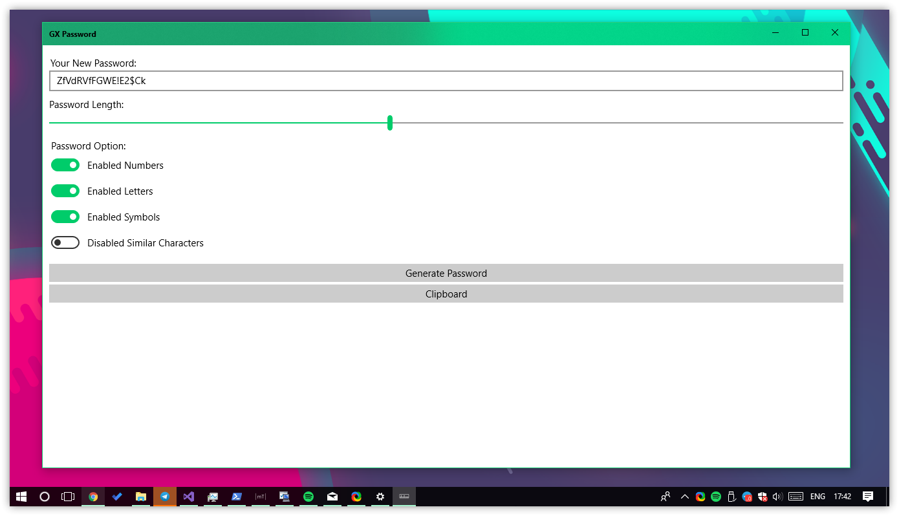

## GX Password
[UWP] A Quick, Easy and Secure Password Generator 

## Store
Windows 10 and Windows 10 Mobile

--------

## Translations
- PT by [Tiago](https://github.com/TiagoDanin) and [Wesley](https://github.com/synk0)
- ES by [Wesley](https://github.com/Synk0) and [Geekfred](https://github.com/geekfred)
- RU by [Daniel](https://github.com/dhavdc) and [Yikal](https://github.com/yikal)
- TH by [Aime](https://github.com/AimeTPGM)
- PL by [Piotr Blazejewicz](https://github.com/peterblazejewicz)
- FY by [Anne Douwe Bouma](https://github.com/anned20)
- NL by [Tom](https://github.com/tomG777)
- DE by [Yikal](https://github.com/yikal)
- UA by [Marusyk](https://github.com/marusyk)
- SV by [Liambagge](https://github.com/liambagge) and [Madesch](https://github.com/madesch)
- FR by [Erickgirard](https://github.com/erickgirard) and [Plasmagun86](https://github.com/plasmagun86)
- HE by [Yotam Salmon](https://github.com/yotam180)
- IT by [Oldmammuth](https://github.com/oldmammuth)
- ID by [Emhaye](https://github.com/emhaye)
- FI by [Matias Kainulainen](https://github.com/mkainula)

## Collaborator
- [BaezCrdrm](https://github.com/baezCrdrm)

## LICENSE
GNU GENERAL PUBLIC LICENSE V3 [(GPLv3)](https://github.com/TiagoDanin/GX-Password/blob/master/LICENSE)

---
> By Tiago Danin
